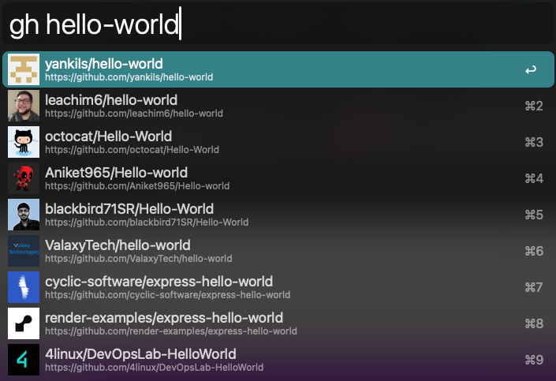

# GitHub Workflow for Alfred

A powerful Alfred workflow that lets you quickly search and access GitHub repositories, pull requests, and more. Built with TypeScript for improved reliability and maintainability.



This is a typescript adaptation of https://github.com/edgarjs/alfred-github-repos improved with caching
and other small things to make something amazing even better.

## Features

- 🔍 **Global Repository Search**: Search any GitHub repository
- 📚 **Personal Repository Search**: Quick access to your repositories
- 🔄 **Pull Request Management**: Search and access your open PRs
- 🏢 **Organization Support**: Search within your organizations
- 🚀 **Fast & Efficient**: Local caching for quick results
- 🔐 **Secure**: Uses GitHub personal access tokens
- 🖼️ **Rich UI**: Shows repository owner avatars in results

## Installation

1. Download the latest release from the [releases page](https://github.com/your-username/github-workflow/releases)
2. Double-click the `.alfredworkflow` file to install
3. Generate a GitHub personal access token:
   - Visit [GitHub Token Settings](https://github.com/settings/tokens/new?description=GitHub%20Repos%20Alfred%20workflow&scopes=repo)
   - Select the `repo` scope
   - Click "Generate token"
4. Set up your token in Alfred:
   - Type `gh-login` in Alfred
   - Paste your token and press Enter

## Usage

### Search Any Repository
```
gh <query>
```
Example: `gh vite` or `gh react stars:>1000`

### Search Your Repositories
```
repo <query>
```
Example: `repo api` or `repo frontend`

### Search Pull Requests
```
pr <query>
```
Example: `pr fix` or `pr feature`

### Clear Cache
```
gh-clear
```
Clears the local cache of repository data and icons.

## Advanced Usage

### Search Modifiers

When using the global search (`gh`), you can use GitHub's search modifiers:

- `stars:>1000` - Repositories with more than 1000 stars
- `language:typescript` - TypeScript repositories
- `org:microsoft` - Repositories from Microsoft
- `fork:true` - Include forked repositories

Example: `gh react stars:>1000 language:typescript`

### Organization Repositories

The `repo` command automatically includes repositories from your organizations. To see all repositories from a specific organization:

```
repo org-name/
```

## Configuration

### Environment Variables

You can customize the behavior by setting these variables in Alfred's workflow configuration:

- `GITHUB_API_HOST`: API host for GitHub Enterprise (default: api.github.com)
- `GITHUB_HOST`: Web host for GitHub Enterprise (default: github.com)
- `PR_ALL_INVOLVE_ME`: Show all PRs you're involved in (default: false)
- `CACHE_TTL_SEC_REPO`: Repository cache TTL in seconds (default: 86400)
- `CACHE_TTL_SEC_PR`: PR cache TTL in seconds (default: 300)
- `CACHE_TTL_SEC_ORG`: Organization cache TTL in seconds (default: 86400)

### GitHub Enterprise

If you're using GitHub Enterprise, update the host settings:

1. Open Alfred Preferences
2. Go to Workflows
3. Select GitHub Workflow
4. Set the following variables:
   - `GITHUB_API_HOST`: Your enterprise API host
   - `GITHUB_HOST`: Your enterprise web host

## Development

### Prerequisites

- Node.js 18 or higher
- npm 9 or higher

### Setup

1. Clone the repository:
   ```bash
   git clone https://github.com/your-username/github-workflow.git
   cd github-workflow
   ```

2. Install dependencies:
   ```bash
   npm install
   ```

3. Create environment file:
   ```bash
   cp .env.dist .env
   ```

4. Update `.env` with your GitHub token

### Development Commands

- `npm run dev`: Watch mode development
- `npm run build`: Build for production
- `npm test`: Run tests
- `npm run test:watch`: Run tests in watch mode

### Project Structure

```
src/
├── cli.ts              # CLI entry point
├── client/            
│   └── github.ts       # GitHub API client
├── commands/           # Command implementations
│   ├── search.ts
│   ├── user-repos.ts
│   └── user-pulls.ts
├── types/              # TypeScript types
└── utils/              # Utility functions
```

## Contributing

1. Fork the repository
2. Create your feature branch: `git checkout -b feature/amazing-feature`
3. Commit your changes: `git commit -m 'Add amazing feature'`
4. Push to the branch: `git push origin feature/amazing-feature`
5. Open a Pull Request

### Development Guidelines

- Write tests for new features
- Follow the existing code style
- Update documentation as needed
- Add comments for complex logic

## License

This project is licensed under the MIT License - see the [LICENSE.md](LICENSE.md) file for details.

## Acknowledgments

- [Alfred App](https://www.alfredapp.com/) for the amazing automation platform
- [GitHub API](https://docs.github.com/en/rest) for the comprehensive API
- Inspired by various Alfred workflows in the community